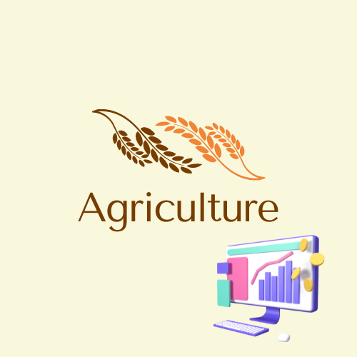

<h1 align="center">
Data for Agribusiness.
</h1>

<h1 align="center">

</h1>

<h2 align="center">
Analysis developed for insurers focused on agribusiness. 
</h2>

<h2 align="center">
 🛠 Technologies
</h2>

-  [Python](https://www.python.org/) 
-  [VS CODE](https://code.visualstudio.com/) 
-  [Pandas](https://pandas.pydata.org/)   
-  [Plotly](https://plotly.com/python/plotly-express/) 
-  [Matplotlib](https://matplotlib.org/3.5.3/api/_as_gen/matplotlib.pyplot.html) 
-  [Seaborn](https://seaborn.pydata.org/) 
-  [Jupyter](https://jupyter.org/) 

<h4 align="center"> 
	 Completed analysis ✅
</h4>
